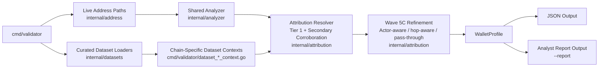
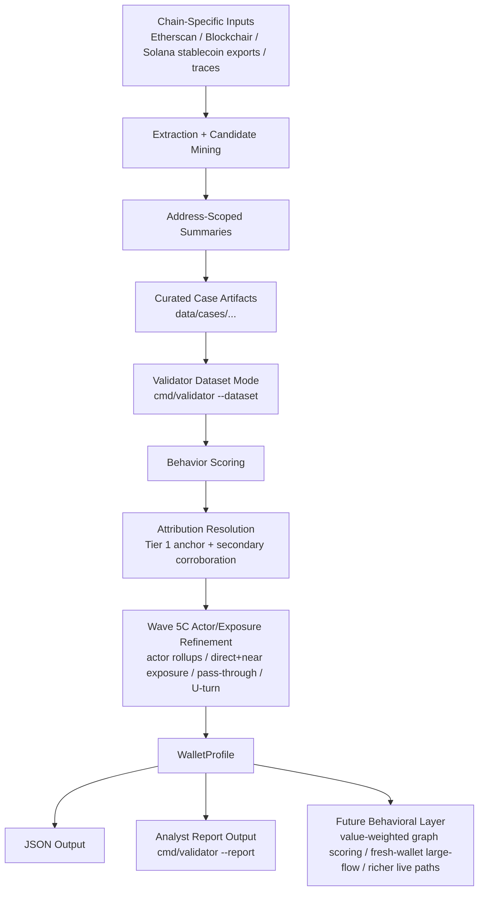

# Crypto Profiler Architecture

## Purpose

This document describes the architecture that is actually implemented in the repository today.

The current implementation picture is that Crypto Profiler has:

- one shared live analyzer used primarily for EVM
- chain-specific dataset-mode scoring adapters for ERC-20, Solana, and Bitcoin
- trace-aware Ethereum case enrichment
- an attribution resolver with Tier 1 precedence, bounded secondary corroboration, and Wave 5C actor/exposure refinement
- an analyst-facing report layer on top of the validator output

It does not yet have one fully unified graph-aware engine across all chains.

---

## Architecture At A Glance

If you only skim one section, this is the story:

1. chain-specific Layer 1 data is extracted into address-scoped summaries outside git
2. small, high-signal curated case artifacts are committed into `data/cases/...`
3. `cmd/validator --dataset` probes the case shape and routes to the right chain adapter
4. behavioral scoring produces a shared `WalletProfile`
5. Tier 1 attribution resolves actor and label context
6. secondary sources can corroborate or conflict without overriding Tier 1
7. Wave 5C applies bounded actor-aware, hop-aware, and pass-through/U-turn refinement where attribution support is strong
8. `cmd/validator --report` turns that profile into a concise analyst-facing brief
9. future behavior layers will sit on top of that shared output contract rather than replacing it

This is why the project works well as both an engineering artifact and a portfolio demo.

---

## Design Principles

### Deterministic first

Sanctions and direct labeled exposure should outweigh weaker heuristics.

### Explainable by construction

Every score should be backed by visible `risk_reasons`, evidence counts, and plain-English descriptions.

### Attribution-aware, not attribution-only

Tier 1 labels can sharpen a score or suppress a false positive, but they do not replace behavioral reasoning.

### Secondary sources stay bounded

Corroborating sources can raise confidence, add modest bounded adjustments, or surface conflicts, but they do not get to dominate scoring on their own.

### Actor-aware refinement stays bounded

Wave 5C can roll repeated interaction and concentration up to actor level, but only when attribution confidence is strong enough to justify it.

### Practical multi-chain realism

Different chains can have different ingestion and scoring paths, as long as they converge on a coherent output shape.

### Dataset mode as a first-class product surface

Curated dataset mode is not a toy in this repo. It is the main delivery path for:

- repeatable demos
- benchmark cases
- trace-aware Ethereum examples
- ERC-20 Layer 1 token-surface scoring
- current Solana Layer 1 scoring
- current Bitcoin Layer 1 scoring

### Portfolio-ready outputs matter

The architecture is intentionally designed so the same validator can serve:

- machine-readable JSON for engineering workflows
- analyst-facing report output for demos and portfolio review

That keeps the repo useful for both implementation depth and presentation quality.

---

## Runtime Surfaces

### 1. Live validator flow

`cmd/validator` chooses an address strategy and returns a `WalletProfile`.

Current live strategies:

- `internal/address/evm.go`
- `internal/address/bitcoin.go`
- `internal/address/solana.go`

Current live behavior by chain:

- EVM: validation, balance/history fetch, watchlist check, shared analyzer scoring
- Bitcoin: validation, balance/history fetch, basic activity state
- Solana: validation, balance/history fetch, basic activity state

### 2. Dataset-backed validator flow

`cmd/validator` also supports `--dataset`.

Dataset mode currently dispatches to:

- shared curated EVM cases
- ERC-20 Layer 1 curated cases
- Solana stablecoin-flow curated cases
- Bitcoin UTXO-flow curated cases

This is where the repo currently delivers its multi-chain Layer 1 scoring story.

### 3. Analyst-facing report flow

`cmd/validator --report` renders a concise analyst brief on top of either:

- live validator output
- curated dataset-mode output

The report layer is intentionally thin:

- it does not invent new scoring logic
- it presents existing scoring, reasons, counterparties, case context, and resolved attribution in a demo-friendly shape

---

## High-Level Architecture

## Artifact Lifecycle

### End-to-end data flow in practice

1. raw chain data is extracted into address-scoped summaries outside git
2. curated benchmark cases are committed into `data/cases/...`
3. `cmd/validator --dataset` probes the case shape and chooses the right chain adapter
4. chain-specific or shared behavior scoring produces a baseline `WalletProfile`
5. Tier 1 attribution resolves contextual or risk-escalating actor information
6. secondary corroboration can raise confidence or surface conflicts
7. Wave 5C can add actor-aware repeated-interaction or concentration refinement, plus bounded exposure findings
8. the output is rendered either as JSON or as an analyst-facing report

### What a reviewer should take away

- the repo is multi-chain, but not falsely chain-agnostic
- curated artifacts are a deliberate product surface, not throwaway fixtures
- Tier 1 attribution improves precision without pretending the repo already has full graph intelligence
- secondary corroboration improves analyst confidence without turning weak sources into hard risk jumps
- Wave 5C adds real investigative nuance without claiming full graph reconstruction
- report mode is a presentation layer on top of real scoring, not a mock demo veneer
- future behavior work is staged as an additive layer, not something the docs pretend already exists

---

## Core Modules

### `internal/address`

Responsible for:

- chain syntax validation
- live balance and activity lookup
- initial `WalletProfile` construction

This module does not currently provide full multi-chain Layer 1 scoring on its own.

### `internal/analyzer`

Responsible for the shared live-scoring engine:

- watchlist short-circuit
- wallet-age signals
- velocity
- repeated flagged interaction
- count-based service concentration
- noisy inbound observations
- combination rules

Today this is the strongest live-scoring path for EVM.

### `internal/attribution`

Responsible for the Wave 5A through 5C attribution layer:

- loading Tier 1 structured label fixtures
- loading Bitcoin mining-pool context
- loading repo-local bootstrap overrides
- loading secondary corroborating sources
- resolving a final attribution decision
- applying controlled post-behavior score modifiers
- rolling repeated interaction or concentration up to actor level when attribution support is strong
- surfacing direct or near actor exposure summaries
- detecting bounded pass-through or U-turn patterns from sampled Layer 1 flows

This package intentionally stops short of full cluster or graph resolution.

### `internal/datasets`

Responsible for:

- loading curated cases
- loading trace summaries
- loading chain-specific curated dataset cases
- building dataset-mode wallet profiles for curated EVM cases

### `cmd/validator/dataset_*_context.go`

Responsible for chain-specific dataset scoring adapters:

- `dataset_trace_context.go`
- `dataset_erc20_layer1_context.go`
- `dataset_solana_stablecoin_context.go`
- `dataset_bitcoin_layer1_context.go`

This is an important architecture detail:

- EVM live scoring uses the shared analyzer
- ERC-20, Solana, and Bitcoin Layer 1 currently score through chain-specific dataset adapters

### Report layer responsibilities

The report layer adds:

- case title and dataset context
- resolved attribution and source context
- concise risk-summary framing
- chain-specific Layer 1 context lines
- actor-aware or hop-aware findings when they materially improve interpretation
- top-counterparty presentation for demos and portfolio review

It does not change the underlying scoring model.

---

## Chain Architecture Today

| Chain    | Current source path                                                                  | Current scoring path                                        | Current limit                                                                      |
|----------|--------------------------------------------------------------------------------------|-------------------------------------------------------------|------------------------------------------------------------------------------------|
| Ethereum | Etherscan live txs, extracted EVM datasets, optional trace summaries                 | Shared analyzer, Tier 1 attribution, bounded secondary corroboration, plus trace-aware dataset context | No trace-driven live scoring, no generalized graph scoring                        |
| ERC-20   | Local Blockchair ERC-20 shards, latest token metadata snapshot, curated ERC-20 cases | Dataset-mode ERC-20 Layer 1 scoring adapter plus attribution hierarchy and Wave 5C actor/exposure refinement | No live token scoring, no swap-aware decoding, no generalized token graph scoring |
| Solana   | Local stablecoin-flow Parquet exports and curated cases                              | Dataset-mode stablecoin scoring adapter plus attribution hierarchy     | No general instruction-aware live scoring                                          |
| Bitcoin  | Local Blockchair inputs/outputs and curated cases                                    | Dataset-mode UTXO-flow scoring adapter plus attribution hierarchy and bounded Wave 5C cluster-aware interpretation | No generalized cluster graph scoring                                               |

---

## Ethereum Layer 1 Architecture

Ethereum currently combines three pieces:

1. top-level live profiling from Etherscan
2. extracted address-scoped curated cases
3. optional trace enrichment for curated cases

### Current EVM flow

1. `cmd/extractcases` scans Blockchair Ethereum and ERC-20 transaction files
2. `cmd/curatecases` builds curated EVM cases
3. `scripts/extract_traces.py` builds address-scoped trace summaries
4. `cmd/enrichcases` merges trace summaries into curated EVM cases
5. `cmd/validator --dataset` loads the curated case and shared analyzer output
6. trace context is appended as observational reasoning

### Why traces are separate

The repo uses traces today to enrich explanation without overstating trace-native scoring maturity.

That keeps the implementation honest:

- trace extraction is real
- trace-aware explanation is real
- trace-native heuristics remain future work

---

## Solana Layer 1 Architecture

Solana Layer 1 is currently stablecoin-flow first.

### Current Solana flow

1. export or collect large-value stablecoin-flow source data outside git
2. `scripts/mine_solana_whale_candidates.py` identifies candidate addresses
3. `scripts/extract_solana_stablecoin.py` builds address-scoped stablecoin summaries
4. `scripts/curate_solana_stablecoin.py` creates curated Solana cases
5. `cmd/validator --dataset` applies Solana-specific stablecoin scoring

### Current Solana responsibilities

- source / destination / authority role interpretation
- broad counterparty surface scoring
- mixed-mint observation
- repeated large counterparty interaction

### Current Solana limitation

This is not yet a full Solana transaction- or program-semantics architecture.

It is a practical Layer 1 stablecoin-flow slice.

---

## ERC-20 Layer 1 Architecture

ERC-20 Layer 1 is now transfer-event first.

### Current ERC-20 flow

1. local Blockchair ERC-20 shards and token metadata stay outside git
2. `scripts/mine_erc20_candidates.py` identifies behavior-driven ERC-20 candidates from the canonical window
3. `scripts/extract_erc20_layer1.py` builds address-scoped summaries plus compressed raw subsets
4. `scripts/curate_erc20_layer1.py` creates curated ERC-20 benchmark cases
5. `cmd/validator --dataset` applies ERC-20-specific Layer 1 scoring

### Current ERC-20 responsibilities

- token-aware inbound vs outbound role summaries
- broad token counterparty surface scoring
- repeated counterparty interaction scoring
- token diversity and single-token concentration observation
- trusted protocol or exchange-style contextual reasoning when Tier 1 attribution exists
- bounded actor-aware refinement when counterparties resolve to the same actor

### Current ERC-20 limitation

This is ERC-20 transfer-row Layer 1 scoring, not full DeFi intent decoding.

It does not yet reconstruct swaps, decode protocol semantics, or use traces for full pass-through scoring.

---

## Bitcoin Layer 1 Architecture

Bitcoin Layer 1 is currently UTXO-flow first.

### Current Bitcoin flow

1. local Blockchair inputs/outputs live outside git
2. `scripts/mine_bitcoin_candidates.py` identifies candidate addresses
3. `scripts/extract_bitcoin_layer1.py` builds address-scoped UTXO summaries
4. `scripts/curate_bitcoin_layer1.py` creates curated Bitcoin cases
5. `cmd/validator --dataset` applies Bitcoin-specific UTXO-flow scoring

### Current Bitcoin responsibilities

- inbound-receipt vs outbound-spend role analysis
- broad counterparty surface scoring
- operational hub scoring
- repeated counterparty interaction scoring

### Current Bitcoin limitation

This is address-level UTXO profiling, not cluster-aware wallet analytics.

---

## Watchlist and Attribution

The current entity layer has three active inputs:

- watchlist engine for sanctions checks
- Tier 1 structured attribution inputs
- repo-local bootstrap overrides for continuity and demos

Tier 1 currently means:

- GraphSense-style structured labels
- Bitcoin mining-pool context
- repo-local bootstrap labels

Wave 5B adds:

- WalletExplorer-style secondary source support
- repo-safe corroborating fixture inputs
- supporting and conflicting source visibility

Wave 5C adds:

- actor-aware repeated-interaction and concentration refinement
- practical direct and near exposure summaries
- bounded pass-through and U-turn findings tied to attributed actors

The important architectural choice is ordering:

1. behavior is scored first
2. Tier 1 attribution is resolved second
3. secondary corroboration can raise confidence or register a conflict
4. Wave 5C actor/exposure refinement is applied when attribution support is strong enough
5. a controlled modifier is applied
6. the report surfaces the resolved attribution concisely

This keeps the system useful for investigations without pretending the repo already has full cluster-aware entity resolution.

---

## Output Contract

Every current scoring path converges on the same high-level output shape:

- address
- network
- validity and validation details
- activity metadata
- `risk_score`
- `risk_grade`
- `review_recommended`
- `risk_breakdown`
- `risk_reasons`
- `attribution` when available
- `attribution_insights` when actor-aware or exposure-aware refinement adds value

This shared output contract is why the repo can mix:

- one shared analyzer
- several chain-specific dataset adapters

without losing coherence for the user.

On top of that contract, report mode adds a human-readable presentation layer without changing the JSON schema.

### Why that matters for portfolio review

This is the architectural choice that keeps the project legible:

- engineers can inspect JSON, tests, and chain-specific adapters
- analysts can read the same result in brief form with `--report`
- recruiters and hiring managers can follow the system without first reading internal code

---

## Data Storage Model

### Kept in git

- source code
- docs
- curated case JSON artifacts
- compact extracted reference fixtures used for examples
- small label/config files

### Kept outside git by default

- raw Blockchair dumps
- raw BigQuery / Parquet exports
- large working extraction outputs
- local candidate lists

The repo deliberately keeps the committed artifacts small enough to support demos and tests without trying to store a full historical warehouse.

---

## Near-Term Expansion

The architecture is set up so the next wave can add:

- value-weighted graph scoring
- fresh-wallet plus immediate large-flow reasoning
- richer Solana and Bitcoin live-path reasoning
- generalized multi-hop exposure beyond the current sampled Wave 5C layer

Those are next-stage additions, not claims about the current implementation.

## Review Path

For the fastest architecture review:

1. read the portfolio snapshot in [`README.md`](README.md)
2. scan the two Mermaid diagrams in this file
3. run one curated report command from [`docs/DEMO-WALKTHROUGH.md`](docs/DEMO-WALKTHROUGH.md)
4. compare the output with the static examples in [`docs/sample-reports/README.md`](docs/sample-reports/README.md)

---

## Related Documents

- [`README.md`](README.md)
- [`docs/TYPOLOGIES.md`](docs/TYPOLOGIES.md)
- [`docs/SCORING.md`](docs/SCORING.md)
- [`docs/EVM-CALLS-INTEGRATION.md`](docs/EVM-CALLS-INTEGRATION.md)
- [`docs/LABEL-SOURCE-HIERARCHY.md`](docs/LABEL-SOURCE-HIERARCHY.md)
- [`docs/ERC20-DATA-MODEL.md`](docs/ERC20-DATA-MODEL.md)
- [`docs/SOLANA-DATA-MODEL.md`](docs/SOLANA-DATA-MODEL.md)
- [`docs/BITCOIN-DATA-MODEL.md`](docs/BITCOIN-DATA-MODEL.md)
