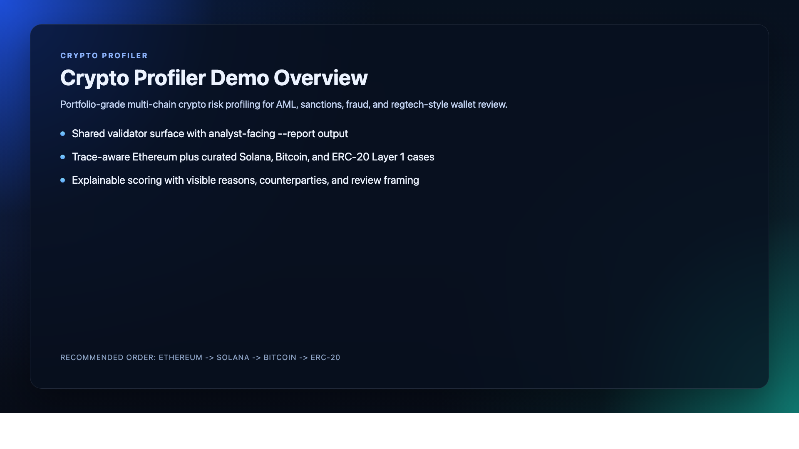
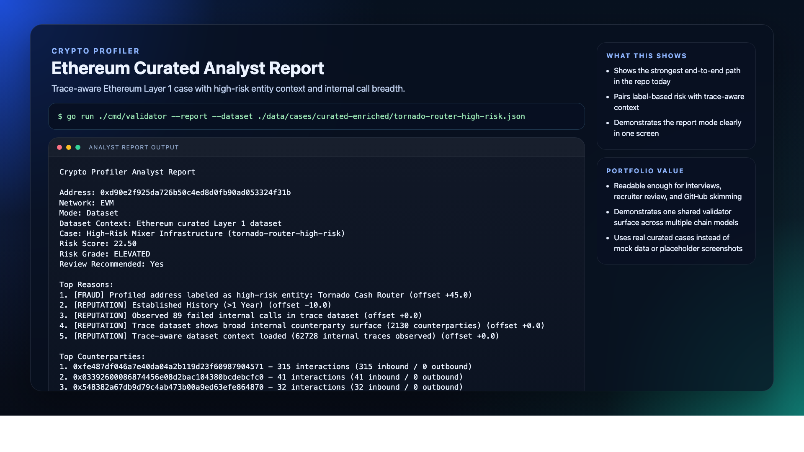
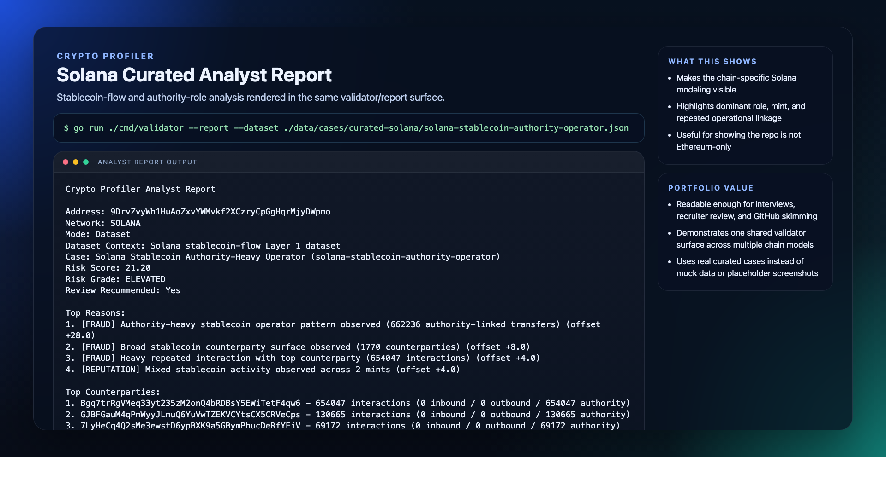
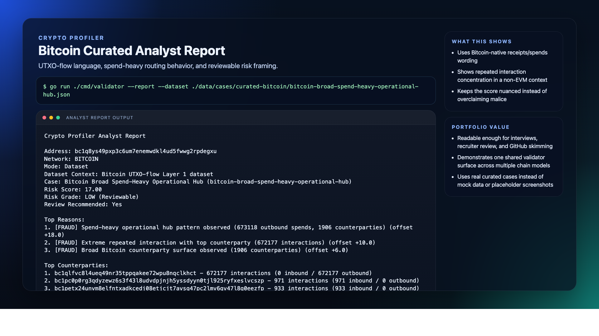
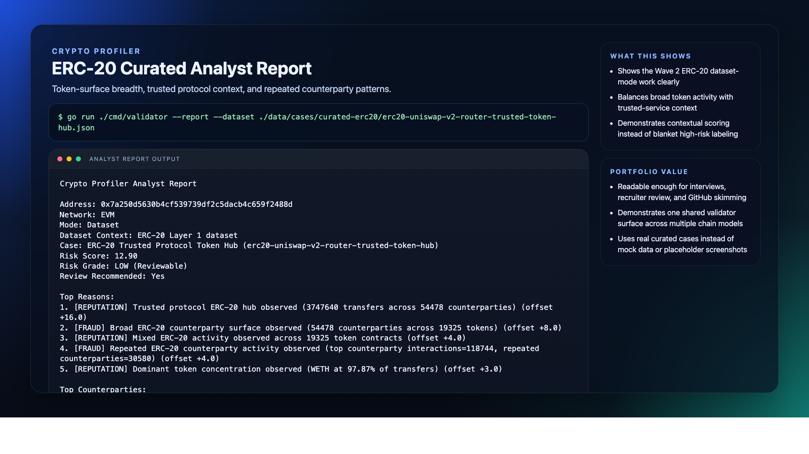

# Crypto Profiler

Portfolio-grade multi-chain crypto risk profiling for AML, sanctions, fraud, and regtech-style wallet review.

[](https://github.com/piyushdaiya/crypto-profiler/actions/workflows/ci.yml)
[](#tech-stack)
[](LICENSE)
[](#current-implementation-status)

Crypto Profiler is a Go-based wallet risk and exposure intelligence project for AML, sanctions, fraud, and crypto investigations.

The repository currently combines:

- shared live scoring for EVM wallets
- curated dataset-mode scoring for Ethereum, Optimism, Polygon, ERC-20, Solana, and Bitcoin cases
- trace-aware Ethereum case enrichment
- attribution-aware scoring with bounded corroboration
- actor and exposure findings in analyst-facing reports
- bounded graph summary reporting when attributed graph coverage is meaningful
- bounded graph-aware score adjustments for selected motifs and concentration patterns
- a watchlist-driven sanctions path

Near-term future work is deeper value-aware path scoring, richer live-path reasoning, broader L2 coverage, and broader graph coverage on top of the current multi-chain base.

---

## Portfolio Snapshot

- Built to demonstrate multi-chain wallet intelligence without pretending Ethereum, Optimism, Polygon, Solana, Bitcoin, and ERC-20 all share the same data model.
- Produces explainable risk output with visible reasons, review recommendations, and an analyst-facing report mode for demos.
- Packages the engineering story end to end: extraction patterns, curated case artifacts, validator dataset mode, CI, security checks, docs, and sample outputs.
- Adds bounded actor-aware, exposure-aware, and graph-aware interpretation without overstating weak evidence.
- Includes practical, cost-conscious Optimism and Polygon Phase 1 workflows built around transactions-only export and homelab-first summarization.

---

## Target Problem Space

Crypto Profiler is built for KYW, AML, fraud, sanctions, and investigative-style wallet review.

The goal is not to be a full chain warehouse. The goal is to make practical wallet profiling explainable and reproducible, with realistic case artifacts and scoring that can be reviewed rule by rule.

Why this matters for crypto-risk and regtech work:

- analysts and compliance reviewers need evidence they can inspect, not just opaque scores
- different chains expose different useful primitives, so the modeling layer should reflect reality
- curated benchmark cases are useful for demos, interviews, and regression testing when live data is noisy or unstable
- attribution and graph context should refine interpretation without pretending weak coverage is strong evidence
- L2 support needs to be practical under real cost constraints, not just technically possible in theory

---

## What This Project Demonstrates

This repository is designed to be portfolio-grade in both engineering and presentation.

It demonstrates:

- multi-chain reasoning without pretending every chain should share one identical data model
- explainable risk scoring through visible `risk_reasons`, evidence counts, and review-oriented grades
- attribution-aware contextualization that can escalate illicit actors, suppress false positives for trusted infrastructure, surface corroboration or conflicts cleanly, and add bounded actor-aware or hop-aware interpretation where the data supports it
- a practical curated-case workflow from extraction to analyst-facing report output
- bounded graph summary reporting, graph motifs, and graph-aware score refinement when attributed graph coverage is meaningful
- disciplined repository storytelling through aligned docs, curated artifacts, tests, and CI security checks
- transactions-only Optimism and Polygon Phase 1 delivery paths that prove L2 expansion can be added in a cost-conscious, homelab-first way

---

## Demo

A short demo reel and static screenshots are included in the repository.

- [74-second demo video](docs/media/video/crypto-profiler-demo.mp4)
- [Sample analyst reports](docs/sample-reports/README.md)
- [Release notes](docs/RELEASE-NOTES.md)

<p align="center">
  
</p>

<p align="center">
  
</p>

<p align="center">
  
</p>

<p align="center">
  
</p>

<p align="center">
  
</p>

---

## Why The Architecture Looks Like This

Crypto Profiler deliberately separates:

- live EVM scoring via a shared analyzer
- curated dataset-mode scoring for Optimism, Polygon, ERC-20, Solana, and Bitcoin
- trace-aware Ethereum enrichment for cases where internal call context materially improves the story
- Tier 1 attribution resolution that is applied after behavior scoring
- secondary corroboration that can raise confidence or surface conflicts without dominating the score
- actor/exposure refinement that stays bounded by attribution confidence
- graph summary reporting that only renders when attributed graph coverage is meaningful

That choice keeps the implementation honest:

- Ethereum is the most mature live path
- Optimism, Polygon, Solana, Bitcoin, and ERC-20 are real scoped expansions, but currently delivered through dataset mode
- Optimism and Polygon Phase 1 are intentionally transactions-only because decoded-events were evaluated and deferred due scan-cost / ROI
- Tier 1 attribution improves precision without pretending the repo already has full entity-resolution
- bounded graph-aware output adds analytical value without overstating thin graph coverage
- the shared output contract stays consistent even when the ingestion and scoring path differs by chain

---

## Analyst Report Mode

The validator supports an analyst-facing report mode on top of the existing JSON output.

JSON remains the default:

```bash
go run ./cmd/validator --dataset ./data/cases/curated-enriched/tornado-router-high-risk.json
```

Use `--report` for a demo-friendly summary:

```bash
go run ./cmd/validator --report --dataset ./data/cases/curated-enriched/tornado-router-high-risk.json
```

Report mode is designed to surface:

- address and network
- case title and dataset context
- risk score, grade, and review recommendation
- resolved attribution and source context
- top reasons
- actor / exposure findings
- graph summary when attributed graph coverage is meaningful
- top counterparties
- short interpretation
- chain context

This mode is meant to make the repo easy to demo in interviews and portfolio reviews without changing the underlying JSON contract used by tests and engineering workflows.

---

## Attribution and Graph Layer

Crypto Profiler adds a normalized attribution and bounded graph-analysis layer on top of the behavioral model.

Implemented now:

- GraphSense-style structured attribution fixtures
- Bitcoin mining-pool context
- repo-local bootstrap labels as deterministic local overrides
- WalletExplorer-style secondary attribution support
- repo-safe corroborating fixtures for confidence uplift and conflict visibility
- resolved attribution in JSON output and `--report`
- controlled post-behavior scoring modifiers
- actor-aware repeated-interaction and concentration refinement when attribution support is strong
- practical direct and near exposure summaries
- bounded pass-through and U-turn findings in dataset-mode reports
- bounded graph summary rollups
- bounded graph-aware scoring for selected motifs and concentration patterns

What this means in practice:

- sanctions, mixers, and other illicit actors can escalate scores more precisely
- trusted protocols, exchanges, mining pools, treasury-like infrastructure, and router-style contextual services can suppress false positives
- corroborating secondary sources can raise confidence and modestly reinforce a result
- conflicting secondary sources are visible to analysts without overriding a stronger Tier 1 source
- actor-aware rollups only apply stronger score refinements when attribution confidence is strong enough
- graph summary only appears when attributed graph coverage is meaningful enough to avoid misleading output
- graph-aware scoring improves explanation without pretending the repo already has a full graph platform

What it does not claim yet:

- full entity-resolution or generalized clustering across arbitrary graph neighborhoods
- value-weighted graph scoring across arbitrary paths
- comprehensive live-path actor rollups outside the current EVM live analyzer
- generalized full-chain graph reconstruction

See [`docs/LABEL-SOURCE-HIERARCHY.md`](docs/LABEL-SOURCE-HIERARCHY.md) for the exact hierarchy.

---

## Current Implementation Status

| Area                           | Status today                          | Notes                                                                                                                                           |
|--------------------------------|---------------------------------------|-------------------------------------------------------------------------------------------------------------------------------------------------|
| EVM live wallet profiling      | Implemented                           | Uses Etherscan transaction history, watchlist checks, Tier 1 attribution, and the shared analyzer.                                              |
| Ethereum curated Layer 1 cases | Implemented                           | Built from extracted address-scoped native and ERC-20 transfer activity.                                                                        |
| Ethereum trace integration     | Implemented                           | Address-scoped traces can be extracted, merged into curated cases, and surfaced in dataset mode.                                                |
| Attribution layer              | Implemented                           | Tier 1 sources, bounded secondary corroboration, and actor/exposure refinement now feed scoring confidence and report output.                   |
| Graph summary reporting        | Implemented                           | Renders only when attributed graph coverage is meaningful.                                                                                      |
| Bounded graph-aware scoring    | Implemented                           | Selected motifs and concentration patterns can add bounded score refinements when coverage is sufficient.                                       |
| Optimism Layer 2               | Implemented in dataset mode (Phase 1) | Transactions-only 90-day BigQuery export summarized locally; decoded-events deferred due cost/ROI.                                              |
| Polygon Layer 2                | Implemented in dataset mode (Phase 1) | Transactions-only 90-day BigQuery export summarized locally; decoded-events deferred due cost/ROI.                                              |
| ERC-20 Layer 1                 | Implemented in dataset mode           | Address-scoped ERC-20 transfer summaries, curated cases, validator dataset scoring, and attribution-aware contextualization are in place.       |
| Solana Layer 1                 | Implemented in dataset mode           | Current Solana layer is stablecoin-flow based and curated from large-value USDC/USDT summaries.                                                 |
| Bitcoin Layer 1                | Implemented in dataset mode           | Current Bitcoin layer is address-level UTXO-flow based, with mining-pool context and bounded WalletExplorer-style corroboration in attribution. |
| Solana live Layer 1 scoring    | Not implemented                       | Live Solana strategy currently provides address validation and basic activity/balance lookup only.                                              |
| Bitcoin live Layer 1 scoring   | Not implemented                       | Live Bitcoin strategy currently provides address validation and basic activity/balance lookup only.                                             |
| Full graph platform            | Not implemented                       | The current graph layer is sampled, bounded, and explanation-first rather than a generalized graph engine.                                      |

---

## Multi-Chain Story

### Ethereum

Ethereum is the most mature path in the repo today.

Implemented now:

- live analyzer scoring from top-level EVM activity and labels
- curated EVM case generation from extracted address-scoped transfer data
- optional trace enrichment for curated cases
- validator dataset mode that surfaces trace-aware internal-call context
- attribution-aware contextualization for named actors and infrastructure, with bounded corroborating-source support
- sampled actor-aware direct exposure, near-exposure, pass-through / U-turn reporting, and bounded graph-aware refinement where attributed counterparties exist

Not implemented yet:

- trace-driven live scoring
- generalized graph-aware exposure beyond the current sampled actor/exposure and bounded graph-summary layer

### Optimism Layer 2 (Phase 1)

Optimism Phase 1 is currently implemented in dataset mode using a transactions-only workflow.

Implemented now:

- candidate mining from Google Cloud Blockchain Analytics / BigQuery over the same canonical 90-day window used elsewhere in the repo
- shortlist export to Parquet
- homelab-first local summarization
- curated Optimism cases under `data/cases/curated-optimism/`
- validator dataset-mode scoring for:
  - repeated-contract, router-like behavior
  - broad operational hub behavior
- analyst-facing report output for Optimism cases

Important implementation note:

- Phase 1 is intentionally transactions-only
- decoded-events were evaluated but deferred for now because scan-cost / ROI was weak relative to the value needed for the first pass
- this keeps the Optimism path practical within a homelab-first, credits-conscious workflow

Current curated Optimism cases:

- `optimism-repeated-contract-router-like`
- `optimism-broad-operational-hub`

### Polygon Layer 2 (Phase 1)

Polygon Phase 1 is currently implemented in dataset mode using a transactions-only workflow.

Implemented now:

- candidate mining from Google Cloud Blockchain Analytics / BigQuery over the same canonical 90-day window used elsewhere in the repo
- shortlist export to Parquet
- homelab-first local summarization
- curated Polygon cases under `data/cases/curated-polygon/`
- validator dataset-mode scoring for:
  - repeated-contract, service-like behavior
  - broad operational hub behavior
- analyst-facing report output for Polygon cases

Important implementation note:

- Phase 1 is intentionally transactions-only
- decoded-events were evaluated but deferred for now because scan-cost / ROI was weak relative to the value needed for the first pass
- this keeps the Polygon path practical within a homelab-first, credits-conscious workflow

Current curated Polygon cases:

- `polygon-repeated-contract-service-like`
- `polygon-broad-operational-hub`

### ERC-20

ERC-20 is a dedicated dataset-mode path built from local Blockchair ERC-20 transfer shards plus token metadata snapshots.

Implemented now:

- behavior-driven ERC-20 candidate mining from local transfer data
- address-scoped ERC-20 extraction with raw subset artifacts and summary JSON
- curated ERC-20 cases under `data/cases/curated-erc20/`
- validator dataset-mode scoring for trusted protocol hubs, noisy inbound token surfaces, broad token surfaces, mixed token activity, repeated counterparties, and token concentration
- attribution-aware contextual suppression for trusted protocol and exchange-style cases, plus secondary corroboration in reports
- actor-aware contextual clustering and repeated-interaction interpretation when counterparties resolve to the same actor
- bounded graph summary rendering only when attributed graph coverage is meaningful

Not implemented yet:

- live ERC-20 scoring inside the EVM address strategy
- swap-aware decoding or protocol-intent interpretation
- trace-aware ERC-20 swap decoding
- generalized token graph scoring

### Solana

Solana is currently stablecoin-flow based.

Implemented now:

- extracted stablecoin summaries from local whale-flow exports
- curated Solana cases under `data/cases/curated-solana/`
- validator dataset-mode scoring for role-heavy and broad-surface stablecoin behavior
- attribution-aware reporting when a curated case resolves to a known actor or contextual label

Not implemented yet:

- general instruction-aware Solana profiling
- non-stablecoin Solana scoring
- live Solana scoring from full extracted history
- broader graph-aware scoring beyond the current bounded architecture

### Bitcoin

Bitcoin is currently UTXO-flow based.

Implemented now:

- extracted address-scoped Bitcoin summaries from local Blockchair inputs/outputs
- curated Bitcoin cases under `data/cases/curated-bitcoin/`
- validator dataset-mode scoring for spend-heavy, inbound-heavy, mixed-flow, and broad-surface behavior
- Tier 1 mining-pool context plus secondary WalletExplorer-style context for analyst interpretation and false-positive reduction
- bounded actor-aware cluster grouping when WalletExplorer-style context links multiple sampled addresses to the same service actor
- bounded graph summary rollups when attributed graph coverage is meaningful

Not implemented yet:

- generalized cluster-aware modeling
- change detection
- graph-aware peel-chain scoring beyond the current bounded motif layer

---

## Validator Dataset Mode

Validator dataset mode currently supports:

- curated Ethereum cases in `data/cases/curated/`
- trace-enriched Ethereum cases in `data/cases/curated-enriched/`
- curated Optimism cases in `data/cases/curated-optimism/`
- curated Polygon cases in `data/cases/curated-polygon/`
- curated ERC-20 cases in `data/cases/curated-erc20/`
- curated Solana cases in `data/cases/curated-solana/`
- curated Bitcoin cases in `data/cases/curated-bitcoin/`

Examples:

```bash
go run ./cmd/validator --report --dataset ./data/cases/curated-enriched/tornado-router-high-risk.json
go run ./cmd/validator --report --dataset ./data/cases/curated-optimism/optimism-repeated-contract-router-like.json
go run ./cmd/validator --report --dataset ./data/cases/curated-optimism/optimism-broad-operational-hub.json
go run ./cmd/validator --report --dataset ./data/cases/curated-polygon/polygon-repeated-contract-service-like.json
go run ./cmd/validator --report --dataset ./data/cases/curated-polygon/polygon-broad-operational-hub.json
go run ./cmd/validator --report --dataset ./data/cases/curated-solana/solana-stablecoin-authority-operator.json
go run ./cmd/validator --report --dataset ./data/cases/curated-bitcoin/bitcoin-broad-spend-heavy-operational-hub.json
go run ./cmd/validator --report --dataset ./data/cases/curated-erc20/erc20-uniswap-v2-router-trusted-token-hub.json
```

Dataset mode is the current delivery path for:

- reproducible demos
- case-study walkthroughs
- trace-aware EVM examples
- Optimism Phase 1 tx-only L2 scoring
- Polygon Phase 1 tx-only L2 scoring
- ERC-20 token-surface scoring
- Solana stablecoin-flow scoring
- Bitcoin UTXO-flow scoring
- attribution-aware analyst reports with corroborating and conflicting source context
- bounded graph summary and graph-aware scoring where graph coverage is strong enough

---

## Curated Case Coverage By Chain

The repo currently includes checked-in benchmark cases for:

- Ethereum native and trace-enriched cases under `data/cases/curated/` and `data/cases/curated-enriched/`
- Optimism Phase 1 cases under `data/cases/curated-optimism/`
- Polygon Phase 1 cases under `data/cases/curated-polygon/`
- Solana stablecoin-flow cases under `data/cases/curated-solana/`
- Bitcoin UTXO-flow cases under `data/cases/curated-bitcoin/`
- ERC-20 token-surface cases under `data/cases/curated-erc20/`

These are not toy fixtures. They are the primary way the repo demonstrates repeatable scoring behavior, report rendering, and chain-specific interpretation.

---

## Live Validator Mode

The live validator currently supports three chain strategies:

- EVM via Etherscan
- Bitcoin via Blockchain.com
- Solana via CoinStats

Example:

```bash
go run ./cmd/validator 0xd90e2f925da726b50c4ed8d0fb90ad053324f31b
```

Important nuance:

- live EVM has the strongest current scoring path
- live Bitcoin and live Solana are still basic address-state lookups, not full dataset-mode scoring
- Optimism and Polygon are currently dataset-mode only
- graph-aware reporting is currently strongest in curated dataset mode, where sampled structure is reproducible

---

## Data Pipeline

The repo includes an intentionally lightweight extract-and-curate workflow.

### Ethereum

- `cmd/extractcases` builds address-scoped EVM extracted datasets
- `cmd/curatecases` turns extracted datasets into curated cases
- `scripts/extract_traces.py` builds address-scoped trace summaries
- `cmd/enrichcases` merges trace summaries into curated EVM cases

### Optimism

- BigQuery candidate mining is used to identify shortlisted L2 addresses over the canonical 90-day window
- shortlisted transactions are exported to Parquet
- exported Parquet is summarized locally on the homelab
- `scripts/curate_optimism_layer2.py` creates curated Optimism cases

### Polygon

- BigQuery candidate mining is used to identify shortlisted L2 addresses over the canonical 90-day window
- shortlisted transactions are exported to Parquet
- exported Parquet is summarized locally on the homelab
- `scripts/curate_polygon_layer2.py` creates curated Polygon cases

### Solana

- `scripts/mine_solana_whale_candidates.py` mines stablecoin-flow candidates
- `scripts/extract_solana_stablecoin.py` builds extracted stablecoin summaries
- `scripts/curate_solana_stablecoin.py` creates curated Solana cases

### Bitcoin

- `scripts/mine_bitcoin_candidates.py` mines UTXO-flow candidates
- `scripts/extract_bitcoin_layer1.py` builds extracted Bitcoin summaries
- `scripts/curate_bitcoin_layer1.py` creates curated Bitcoin cases

### ERC-20

- `scripts/mine_erc20_candidates.py` mines ERC-20 Layer 1 candidates from local Blockchair transfer shards
- `scripts/extract_erc20_layer1.py` builds extracted ERC-20 summaries and compressed raw subsets
- `scripts/curate_erc20_layer1.py` creates curated ERC-20 cases

---

## Current Curated Cases

### Ethereum

- `data/cases/curated/public-wallet-noisy-inbound.json`
- `data/cases/curated/tornado-router-high-risk.json`
- `data/cases/curated/uniswap-v3-router-trusted-protocol.json`
- trace-enriched variants under `data/cases/curated-enriched/`

### Optimism

- `data/cases/curated-optimism/optimism-repeated-contract-router-like.json`
- `data/cases/curated-optimism/optimism-broad-operational-hub.json`

### Polygon

- `data/cases/curated-polygon/polygon-repeated-contract-service-like.json`
- `data/cases/curated-polygon/polygon-broad-operational-hub.json`

### Solana

- `data/cases/curated-solana/solana-usdc-distributor-treasury-like.json`
- `data/cases/curated-solana/solana-stablecoin-authority-operator.json`
- `data/cases/curated-solana/solana-broad-surface-authority-mixed-stablecoin.json`

### Bitcoin

- `data/cases/curated-bitcoin/bitcoin-broad-spend-heavy-operational-hub.json`
- `data/cases/curated-bitcoin/bitcoin-noisy-inbound-broad-surface.json`
- `data/cases/curated-bitcoin/bitcoin-legacy-mixed-flow-broad-value.json`

### ERC-20

- `data/cases/curated-erc20/erc20-uniswap-v2-router-trusted-token-hub.json`
- `data/cases/curated-erc20/erc20-exchange-like-broad-service-surface.json`
- `data/cases/curated-erc20/erc20-noisy-inbound-broad-token-surface.json`

---

## Documentation Map

- [`ARCHITECTURE.md`](ARCHITECTURE.md)
- [`docs/sample-reports/README.md`](docs/sample-reports/README.md)
- [`docs/TYPOLOGIES.md`](docs/TYPOLOGIES.md)
- [`docs/SCORING.md`](docs/SCORING.md)
- [`docs/EVM-CALLS-INTEGRATION.md`](docs/EVM-CALLS-INTEGRATION.md)
- [`docs/LABEL-SOURCE-HIERARCHY.md`](docs/LABEL-SOURCE-HIERARCHY.md)
- [`docs/ETHEREUM-DATA-MODEL.md`](docs/ETHEREUM-DATA-MODEL.md)
- [`docs/SOLANA-DATA-MODEL.md`](docs/SOLANA-DATA-MODEL.md)
- [`docs/BITCOIN-DATA-MODEL.md`](docs/BITCOIN-DATA-MODEL.md)
- [`docs/ERC20-DATA-MODEL.md`](docs/ERC20-DATA-MODEL.md)
- [`docs/DATA-SOURCING-POLICY.md`](docs/DATA-SOURCING-POLICY.md)

Recommended reading order for the current repo state:

1. this README
2. `ARCHITECTURE.md`
3. `docs/TYPOLOGIES.md`
4. `docs/SCORING.md`
5. chain-specific data model docs

---

## Security

The repo includes:

- a watchlist / sanctions engine
- malformed-input and validator safety tests
- focused dataset-loader and dataset-mode regression tests
- attribution, graph-summary, and report rendering regression tests
- reproducible `govulncheck` and `gosec` checks in CI and locally
- practical OWASP-oriented security coverage

See:

- [`SECURITY.md`](SECURITY.md)
- [`docs/security/owasp-test-matrix.md`](docs/security/owasp-test-matrix.md)

---

## Testing

Run locally:

```bash
make test
make test-verbose
make build
make security
```

Direct commands also work after `make security-tools` or when `./.tools/bin` is on your `PATH`:

```bash
go test ./... -v
govulncheck ./...
gosec ./...
```

What the current automated coverage emphasizes:

- validator dataset-mode routing across Ethereum, Optimism, Polygon, Solana, Bitcoin, and ERC-20 curated cases
- curated loader failure modes for malformed JSON and missing required fields
- chain-specific Solana, Bitcoin, ERC-20, Optimism, and Polygon dataset scoring thresholds and differentiated reason generation
- attribution resolution, corroboration, and conflict handling
- actor/exposure refinement behavior
- bounded graph-summary and graph-scoring behavior
- report rendering for graph-aware and chain-context signals
- file/path safety regressions around local trace-summary lookups
- watchlist, label-loading, and malformed-input CLI safety checks already in the repo

What it does not claim yet:

- fuzzing across the extraction scripts
- full secret scanning / SBOM generation
- deployment hardening or external service penetration testing

Dataset-mode validation examples:

```bash
go run ./cmd/validator --dataset ./data/cases/curated-enriched/uniswap-v3-router-trusted-protocol.json
go run ./cmd/validator --dataset ./data/cases/curated-optimism/optimism-repeated-contract-router-like.json
go run ./cmd/validator --dataset ./data/cases/curated-polygon/polygon-repeated-contract-service-like.json
go run ./cmd/validator --dataset ./data/cases/curated-erc20/erc20-exchange-like-broad-service-surface.json
go run ./cmd/validator --dataset ./data/cases/curated-solana/solana-usdc-distributor-treasury-like.json
go run ./cmd/validator --dataset ./data/cases/curated-bitcoin/bitcoin-noisy-inbound-broad-surface.json
```

---

## Next Practical Work

The next major items after the current implementation are:

- deeper graph coverage for cases where current attribution coverage is still sparse
- richer value-aware path reasoning
- fresh-wallet plus immediate large-flow reasoning
- stronger live Solana and Bitcoin scoring
- broader protocol-intent interpretation for ERC-20 and trace-enriched EVM paths
- Optimism Phase 1.5 or Phase 2 event-aware enhancement if scan-cost / ROI becomes favorable
- Polygon Phase 1.5 or Phase 2 event-aware enhancement if scan-cost / ROI becomes favorable

---

## Tech Stack

- Go 1.25
- Docker / Docker Compose
- watchlist-driven sanctions checks
- Blockchair historical datasets for EVM, ERC-20, and Bitcoin extraction
- BigQuery exports for Ethereum traces, Optimism Phase 1 transactions, Polygon Phase 1 transactions, and Solana stablecoin-flow source data
